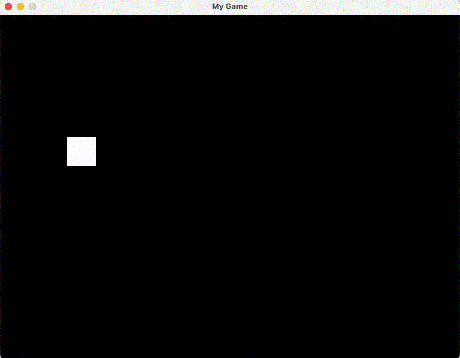

# My Game
Simple Java 2D Game

```bash
# created maven project
mvn archetype:generate \
  -DarchetypeGroupId=org.apache.maven.archetypes \
  -DarchetypeArtifactId=maven-archetype-quickstart \
  -DarchetypeVersion=1.5 \
  -DgroupId=com.github.saviosailas \
  -DartifactId="MyGame" \
  -Dversion=1.0-SNAPSHOT \
  -Dpackage=com.gitlab.saviosailas.my_game \
  -DinteractiveMode=false

# mvn archetype:generate -DarchetypeGroupId=org.apache.maven.archetypes -DarchetypeArtifactId=maven-archetype-quickstart -DarchetypeVersion=1.5
```

### Day 1


### Day 2
- Added key listener for W, A, S ans D
- Added 60 FPS animation



---
```java
@Override
    public void run() {
        double drawIntervel = (oneBillion / fps);
        long lastTime = System.nanoTime();
        long currentTime;
        double delta = 0;
        while (gameThread != null) {
            currentTime = System.nanoTime();
            delta = delta + (currentTime - lastTime) / drawIntervel;
            lastTime = currentTime;
            if (delta >= 1) {
                update();
                repaint();
                delta--;
            }
        }
    }
```

### **What is this function doing?**

This function is called `run()` and is part of a class that implements the `Runnable` interface (common in Java for running tasks in a separate thread). The `@Override` means it’s replacing a default version of the `run()` method from the `Runnable` interface.

The purpose of this code is to:
1. Run a game loop that keeps the game alive.
2. Control how often the game updates its logic (like moving a character) and redraws the screen (like showing the character’s new position).
3. Try to maintain a consistent speed, measured in **frames per second (FPS)**, so the game looks smooth.

---

### **Line-by-line explanation**

Let’s go through each line and explain what it does, including the math and why it’s needed.

#### **1. `@Override`**
```java
@Override
```
- **What it means**: This tells Java that this `run()` method is replacing a method from a parent class or interface (in this case, `Runnable`).
- **Why it’s here**: The `Runnable` interface requires a `run()` method to define what happens when a thread starts. By overriding it, we’re saying, “Here’s my custom version of what to do when the thread runs.”
- **For a 15-year-old**: Think of it like rewriting the instructions for a toy robot. The robot comes with a default “walk forward” command, but you’re saying, “No, I want it to dance instead.”

---

#### **2. `public void run()`**
```java
public void run() {
```
- **What it means**: This defines the `run()` method, which is the main code that runs when the game’s thread starts. `public` means anyone can call it, `void` means it doesn’t return anything.
- **Why it’s here**: This is where the game loop lives. It’s like the engine of a car that keeps running to make the game work.
- **For a 15-year-old**: Imagine this as the “start button” for your game. When you press it, this code starts and keeps the game moving.

---

#### **3. `double drawIntervel = (oneBillion / fps);`**
```java
double drawIntervel = (oneBillion / fps);
```
- **What it means**:
  - `oneBillion` is likely a constant equal to 1,000,000,000 (1 billion nanoseconds, which is 1 second).
  - `fps` is the desired **frames per second** (e.g., 60 FPS means 60 updates per second).
  - `drawIntervel` calculates how many **nanoseconds** should pass between each frame to achieve the desired FPS.
  - `double` means it’s a number that can have decimal points (like 16.6667).
- **Math calculation**:
  - If `fps = 60`, then:
    \[
    \text{drawIntervel} = \frac{1,000,000,000}{60} \approx 16,666,666.6667 \text{ nanoseconds}
    \]
  - This means each frame should take about 16.67 million nanoseconds (or roughly 16.67 milliseconds, since 1 millisecond = 1,000,000 nanoseconds).
- **Why it’s here**: The game needs to know how long to wait between updates to keep a consistent speed. If you want 60 FPS, each frame gets \( \frac{1}{60} \) seconds.
- **For a 15-year-old**: Imagine you’re flipping through a flipbook to make a cartoon move. To make it look smooth at 60 pages per second, you need to flip a new page every \( \frac{1}{60} \) seconds. This line calculates that time in nanoseconds.
- **Why nanoseconds?**: Computers are super fast, so we use nanoseconds (billionths of a second) for precise timing.

---

#### **4. `long lastTime = System.nanoTime();`**
```java
long lastTime = System.nanoTime();
```
- **What it means**:
  - `System.nanoTime()` gets the current time in nanoseconds (a very precise clock).
  - `lastTime` stores this time as a `long` (a large whole number).
- **Why it’s here**: We need to know when the last frame happened so we can calculate how much time has passed since then.
- **For a 15-year-old**: Think of this as checking your watch when you start running a lap. You’ll check it again later to see how long the lap took.

---

#### **5. `long currentTime;`**
```java
long currentTime;
```
- **What it means**: Declares a variable `currentTime` to store the current time later in the loop.
- **Why it’s here**: We’ll use this to keep track of the time each time the loop runs.
- **For a 15-year-old**: This is like reserving a spot to write down the time when you finish your next lap.

---

#### **6. `double delta = 0;`**
```java
double delta = 0;
```
- **What it means**: `delta` is a variable that keeps track of how much time has accumulated toward the next frame. It starts at 0.
- **Why it’s here**: We use `delta` to decide when enough time has passed to update and draw the next frame.
- **For a 15-year-old**: Imagine you’re saving up pennies to buy a $1 candy. `delta` is how many pennies you’ve saved so far. When you get to 100 pennies (1 dollar), you can “buy” the next frame.

---

#### **7. `while (gameThread != null) {`**
```java
while (gameThread != null) {
```
- **What it means**: This starts a loop that keeps running as long as `gameThread` is not null. `gameThread` is likely the thread running the game.
- **Why it’s here**: This is the game loop. It keeps the game running until the thread is stopped (e.g., when you close the game).
- **For a 15-year-old**: This is like saying, “Keep playing the game until I tell you to stop.” The game stops when `gameThread` is set to null (like pressing the “quit” button).

---

#### **8. `currentTime = System.nanoTime();`**
```java
currentTime = System.nanoTime();
```
- **What it means**: Updates `currentTime` with the current time in nanoseconds.
- **Why it’s here**: We need to know the current time to calculate how much time has passed since the last frame.
- **For a 15-year-old**: This is like checking your watch again at the end of your lap to see how long it took.

---

#### **9. `delta = delta + (currentTime - lastTime) / drawIntervel;`**
```java
delta = delta + (currentTime - lastTime) / drawIntervel;
```
- **What it means**:
  - `currentTime - lastTime` calculates how many nanoseconds have passed since the last frame.
  - Dividing by `drawIntervel` converts that time into a fraction of a frame.
  - Add this fraction to `delta` to keep track of accumulated time.
- **Math calculation**:
  - Suppose `fps = 60`, so `drawIntervel ≈ 16,666,666.6667` nanoseconds.
  - If `currentTime - lastTime = 8,333,333` nanoseconds (half a frame’s time):
    `8,333,333/16,666,666.6667 ≈ 0.5`
    So, `delta = delta + 0.5`.
  - If `delta` was 0.3 before, now `delta = 0.3 + 0.5 = 0.8`.
- **Why it’s here**: This tracks how close we are to needing a new frame. When `delta` reaches 1 or more, it means enough time has passed for a full frame.
- **For a 15-year-old**: Remember the candy example? If each frame costs $1, and you earn 50 cents in one loop, you add 0.5 to `delta`. When `delta` gets to 1 or more, you’ve saved enough to “buy” a frame.
- **Why divide by `drawIntervel`?**: Dividing converts raw time (nanoseconds) into a fraction of a frame, making it easier to check when a full frame’s time has passed.

---

#### **10. `lastTime = currentTime;`**
```java
lastTime = currentTime;
```
- **What it means**: Updates `lastTime` to the current time, so the next loop can measure time from this point.
- **Why it’s here**: We need to reset the starting point for the next time calculation.
- **For a 15-year-old**: After finishing a lap, you note the end time as the start time for your next lap.

---

#### **11. `if (delta >= 1) {`**
```java
if (delta >= 1) {
```
- **What it means**: Checks if `delta` is at least 1, meaning enough time has passed for at least one frame.
- **Why it’s here**: We only want to update and draw the game when enough time has passed to keep the FPS consistent.
- **For a 15-year-old**: This is like checking if you’ve saved enough pennies (100) to buy the $1 candy. If yes, you can “spend” it on a frame.

---

#### **12. `update();`**
```java
update();
```
- **What it means**: Calls a method named `update()`, which likely handles the game’s logic (e.g., moving characters, checking collisions).
- **Why it’s here**: This is where the game figures out what’s happening next (like making your character jump).
- **For a 15-year-old**: Think of this as updating your game’s story, like deciding where Mario moves next.

---

#### **13. `repaint();`**
```java
repaint();
```
- **What it means**: Calls a method named `repaint()`, which tells the game to redraw the screen (e.g., show Mario in his new position).
- **Why it’s here**: After updating the game’s logic, we need to show the new state on the screen.
- **For a 15-year-old**: This is like drawing the next page in your flipbook to show the updated cartoon.

---

#### **14. `delta--;`**
```java
delta--;
```
- **What it means**: Subtracts 1 from `delta`, since we just “used up” one frame’s worth of time.
- **Why it’s here**: We need to reset `delta` to track the next frame. If `delta` was 1.2, it becomes 0.2, keeping the extra 0.2 for the next loop.
- **For a 15-year-old**: After buying the $1 candy, you subtract $1 from your savings. If you had $1.20, you’re left with $0.20 to keep saving.
- **Why not `delta = 0`?**: Sometimes the loop runs a bit late, so `delta` might be more than 1 (e.g., 1.2). Keeping the extra fraction ensures we don’t lose that time, making the game smoother.

---

#### **15. Closing braces `}`**
```java
        }
    }
```
- These close the `if` block, the `while` loop, and the `run()` method.

---

### **Why is the code written this way?**

This code uses a **fixed timestep game loop** with **delta time** to keep the game running at a consistent speed (e.g., 60 FPS) no matter how fast or slow the computer is. Here’s why each part is important:

1. **Using nanoseconds**: Computers are fast, and games need precise timing. Nanoseconds allow us to measure tiny time differences accurately.
2. **Delta time**: By accumulating time in `delta`, the game can handle situations where the computer runs faster or slower. If the computer is slow and a frame takes longer, `delta` might be 1.5, so the game can “catch up” by updating and drawing once but keeping the extra 0.5.
3. **Fixed FPS**: Dividing by `drawIntervel` ensures the game updates exactly 60 times per second (or whatever `fps` is), making movement smooth and predictable.
4. **Thread loop**: The `while (gameThread != null)` keeps the game running until the player quits, and using a separate thread prevents the game from freezing the rest of the program.
5. **Separate `update()` and `repaint()`**: Splitting logic (what happens) and rendering (what’s drawn) makes the code easier to manage and reuse.

---

### **Example: How it works step-by-step**

Let’s pretend `fps = 60`, so `drawIntervel = 16,666,666.6667` nanoseconds. Here’s how the loop runs over a few iterations:

1. **First loop**:
   - `lastTime = 1,000,000,000` (some starting time).
   - `currentTime = 1,008,333,333` (8.33 million nanoseconds later).
   - Time passed = `1,008,333,333 - 1,000,000,000 = 8,333,333`.
   - `delta = 0 + 8,333,333 / 16,666,666.6667 ≈ 0.5`.
   - `lastTime = 1,008,333,333`.
   - `delta < 1`, so skip `update()` and `repaint()`.

2. **Second loop**:
   - `currentTime = 1,016,666,666` (another 8.33 million nanoseconds).
   - Time passed = `1,016,666,666 - 1,008,333,333 = 8,333,333`.
   - `delta = 0.5 + 8,333,333 / 16,666,666.6667 ≈ 0.5 + 0.5 = 1.0`.
   - `lastTime = 1,016,666,666`.
   - `delta >= 1`, so:
     - Call `update()` (move game objects).
     - Call `repaint()` (draw the screen).
     - `delta = 1.0 - 1 = 0.0`.

3. **Third loop**:
   - Repeat, accumulating time until `delta >= 1` again.

This keeps the game updating exactly 60 times per second, even if the computer’s speed varies slightly.

---

### **What happens if we don’t do it this way?**

- **No delta time**: If we just updated every loop, a fast computer might update 1000 times per second, making the game too fast, while a slow computer might update 10 times per second, making it sluggish.
- **No fixed FPS**: Without `drawIntervel`, the game’s speed would depend on the computer’s speed, making it inconsistent.
- **No thread**: Without a separate thread, the game might freeze the window’s controls (like the “close” button).

---

### **For a 15-year-old: A fun analogy**

Imagine you’re making a stop-motion movie with a toy car. You want it to move smoothly at 60 frames per second:
- Each frame is a photo you take.
- You need to take a photo every \( \frac{1}{60} \) seconds (like `drawIntervel`).
- You check your watch (`System.nanoTime()`) to see how much time has passed.
- You keep a tally (`delta`) of how close you are to needing the next photo.
- When you’ve waited long enough (`delta >= 1`), you move the car (`update()`) and take a photo (`repaint()`).
- You subtract the time you used (`delta--`) and keep going until you stop filming (`gameThread == null`).

This code is like a super-precise director making sure every photo is taken at the right time to make your movie look awesome!

---

### **Tips for learning more**

- **Try it out**: If you’re coding a game, print `delta` or `currentTime - lastTime` to see how the timing works.
- **Change FPS**: Set `fps` to 30 or 120 and see how the game feels.
- **Read about game loops**: Search for “Java game loop tutorial” to see other ways to do this.
- **Ask questions**: If you’re stuck on `update()` or `repaint()`, let me know, and I can explain those too!

---

Let me know if you want me to explain anything further or show you how to test this code!


---

# Delta calculation explanation

Hey! I’m going to explain this part of the code in a super simple way, like telling a story, since you’re 15 and new to Java and game development. We’re focusing on this line:

```java
delta = delta + (currentTime - lastTime) / drawIntervel;
```

and why it’s *outside* the `if` block, how `currentTime - lastTime` calculates the time since the last frame, and what happens even if the game doesn’t update or redraw the screen. I’ll use examples and analogies to make it fun and clear, and I’ll break down every piece so you can follow along.

---

### **What’s the big picture?**

This code is part of a **game loop**, which is like the heartbeat of a video game (think of a game like *Mario* or *Minecraft*). The game loop’s job is to keep the game moving by updating things (like making Mario jump) and drawing them on the screen (showing Mario in the air). The line you’re asking about helps the game keep track of time to make sure everything happens at the right speed, like 60 times per second (60 FPS, or frames per second).

The specific line calculates how much time has passed and adds it to a “time bank” called `delta`. This helps the game decide when it’s time to update and draw the next frame (picture) of the game.

---

### **What does each part of the line mean?**

Let’s break down:

```java
delta = delta + (currentTime - lastTime) / drawIntervel;
```

- **delta**: Think of this as a piggy bank where you save up time. When you have enough “time money” (like $1 worth), you can “spend” it to update and draw the next frame of the game.
- **currentTime**: This is the time right now, measured in nanoseconds (a nanosecond is a billionth of a second). It’s like checking your watch at this exact moment.
- **lastTime**: This is the time from the *previous* loop, like when you last checked your watch.
- **currentTime - lastTime**: Subtracting these gives you how many nanoseconds have passed since the last time you checked. It’s like saying, “How long has it been since I last looked at my watch?”
- **drawIntervel**: This is how many nanoseconds should pass for one frame to keep the game at the right speed (e.g., for 60 FPS, it’s about 16.67 million nanoseconds, or 1/60th of a second).
- **(currentTime - lastTime) / drawIntervel**: This turns the time passed into a fraction of a frame. For example, if half the time for a frame has passed, this gives you 0.5.
- **delta = delta + ...**: Adds this fraction to your `delta` piggy bank, keeping track of how much time you’ve saved up.

---

### **Why is this line *outside* the `if` block?**

The `if` block looks like this:

```java
if (delta >= 1) {
    update();
    repaint();
    delta--;
}
```

- The `if` block only runs when `delta` has enough “time money” (at least 1 full frame’s worth) to update the game’s logic (`update()`) and redraw the screen (`repaint()`).
- The line `delta = delta + (currentTime - lastTime) / drawIntervel;` is *outside* the `if` block because you need to **keep track of time** in every loop, even if you don’t have enough time to update or draw yet.

**Analogy**: Imagine you’re saving up $1 to buy a candy (one frame of the game). Every minute, you get some coins (like 50 cents). You add those coins to your piggy bank (`delta`) every time, even if you don’t have enough to buy the candy yet. You only buy the candy (call `update()` and `repaint()`) when you have $1 or more, but you keep adding coins every minute no matter what.

By putting the `delta` calculation outside the `if`, the game keeps counting time in every loop. This ensures it knows exactly when enough time has passed to make the next move in the game.

---

### **How does `currentTime - lastTime` calculate nanoseconds since the last frame?**

Let’s dive into this part:

- **`currentTime = System.nanoTime();`**: This gets the current time in nanoseconds. For example, it might return a big number like 1,000,000,000 nanoseconds (1 second since the computer started counting).
- **`lastTime`**: This was set to the time from the *previous loop*. For example, if the last loop had `currentTime = 1,000,000,000`, then `lastTime = 1,000,000,000` in the current loop.
- **`currentTime - lastTime`**: Subtracting these tells you how many nanoseconds passed since the last loop.

**Example**:
- In the first loop, `currentTime = 1,000,000,000` and `lastTime = 1,000,000,000` (set before the loop starts).
- In the next loop, `currentTime = 1,008,333,333` (8.33 million nanoseconds later).
- `currentTime - lastTime = 1,008,333,333 - 1,000,000,000 = 8,333,333` nanoseconds.
- This means 8.33 million nanoseconds (or about 8.33 milliseconds) have passed since the last loop.

**Why this works**: Each time the loop runs, `lastTime` is updated to the current `currentTime` (with `lastTime = currentTime;`). So, in the next loop, `lastTime` is the time from the previous loop, and `currentTime` is the new time. Subtracting them always gives you the time since the last loop, which is like the time since the last frame *tried* to happen (even if it didn’t update).

**For you**: Think of it like timing how long it takes to do a dance move. You check your watch now (`currentTime`) and compare it to when you last checked (`lastTime`). The difference tells you how long you’ve been dancing since the last move.

---

### **What’s a frame, and why does it matter?**

A **frame** in a game is like one picture in a flipbook. To make a game look smooth, you need to show many pictures per second (like 60 FPS). Each frame involves:
- **Updating**: Moving things in the game (like making a character run).
- **Drawing**: Showing the new positions on the screen.

The `if (delta >= 1)` block decides when to create a new frame by checking if enough time has passed. But the time-checking part (`currentTime - lastTime`) happens every loop to keep track of time, even if the game isn’t ready to make a new frame yet.

---

### **Why calculate time even if the view isn’t updated?**

The line `delta = delta + (currentTime - lastTime) / drawIntervel;` runs every loop, even if `update()` and `repaint()` don’t, because the game needs to **keep track of time continuously**. Here’s why:

1. **Time keeps moving**: The computer doesn’t stop time just because the game hasn’t updated. If you only calculated time when `delta >= 1`, you’d miss time that passed in between, and the game would get out of sync.
2. **Accumulating time**: Sometimes a loop runs faster or slower (depending on the computer). By adding to `delta` every loop, you save up small bits of time until you have enough for a frame. This makes the game smooth.
3. **Catching up**: If the computer is slow and a loop takes longer, `delta` might become bigger than 1 (e.g., 1.5). The `if` block will then update and draw once, subtract 1 from `delta`, and keep the extra 0.5 for the next loop. This helps the game catch up without losing track of time.

**Analogy**: Imagine you’re baking cookies, and each cookie takes 10 minutes to bake (like `drawIntervel`). You check the clock every minute to see how much time has passed. Even if you don’t have 10 minutes yet, you keep adding the time to a notebook (`delta`). When your notebook says 10 minutes or more, you bake a cookie (`update()` and `repaint()`). You don’t stop checking the clock just because you’re not baking yet!

---

### **Math step-by-step**

Let’s do an example with numbers to make it clear. Suppose the game wants 60 FPS:
- `drawIntervel = 1,000,000,000 / 60 ≈ 16,666,666.6667` nanoseconds (time for one frame).
- `delta` starts at 0.
- `lastTime` starts at some time, say `1,000,000,000` nanoseconds.

**Loop 1**:
- `currentTime = 1,008,333,333` (8.33 million nanoseconds later).
- `currentTime - lastTime = 1,008,333,333 - 1,000,000,000 = 8,333,333` nanoseconds.
- `(currentTime - lastTime) / drawIntervel = 8,333,333 / 16,666,666.6667 ≈ 0.5` (half a frame’s time).
- `delta = 0 + 0.5 = 0.5`.
- `lastTime = 1,008,333,333` (update for next loop).
- `delta < 1`, so skip `update()` and `repaint()`.

**Loop 2**:
- `currentTime = 1,016,666,666` (another 8.33 million nanoseconds).
- `currentTime - lastTime = 1,016,666,666 - 1,008,333,333 = 8,333,333`.
- `(currentTime - lastTime) / drawIntervel ≈ 0.5`.
- `delta = 0.5 + 0.5 = 1.0`.
- `lastTime = 1,016,666,666`.
- `delta >= 1`, so:
  - Call `update()` (move game objects).
  - Call `repaint()` (draw the screen).
  - `delta = 1.0 - 1 = 0.0`.

**Loop 3**:
- Repeat, adding more time to `delta`.

**Key point**: The `currentTime - lastTime` calculation happens every loop to measure how much time has passed, even if `delta` isn’t big enough to trigger `update()` or `repaint()`. This ensures the game doesn’t “forget” any time that passed.

---

### **What if the view isn’t updated?**

If `delta < 1`, the `if` block doesn’t run, so `update()` and `repaint()` are skipped. But the `delta` calculation still happens because:
- The game needs to keep adding time to `delta` to know when it’s ready for the next frame.
- If you only added time when updating, you’d lose track of small bits of time, and the game would run too slowly or jerkily.
- By always updating `delta`, the game stays accurate. For example, if each loop adds 0.5 to `delta`, after two loops you’ll have `delta = 1`, and the game will update and draw exactly when it should.

**For you**: It’s like saving up for a $10 toy. If you get $5 every day, you add $5 to your savings even if you can’t buy the toy yet. On the second day, you’ll have $10 and can buy it. If you only counted money when you had enough, you’d never save up!

---

### **Why use nanoseconds?**

Nanoseconds are super tiny (a billion in one second), so they let the computer measure time very precisely. Games need this because even a tiny delay can make things look choppy. `System.nanoTime()` is like a super-accurate stopwatch that catches every little bit of time.

---

### **Fun analogy for the whole thing**

Imagine you’re making a flipbook to animate a dancing cat. You want to flip 60 pages per second to make it look smooth:
- Each page is a frame, and you need to draw a new page every 1/60th of a second (about 16.67 milliseconds).
- You have a piggy bank (`delta`) where you save bits of time.
- Every second, you check your watch (`currentTime`) and see how long it’s been since the last check (`lastTime`).
- You add that time to your piggy bank as a fraction of a page (`(currentTime - lastTime) / drawIntervel`).
- When your piggy bank has enough for one page (`delta >= 1`), you draw a new cat pose (`update()`) and show it (`repaint()`), then take one page’s worth of time out of the bank (`delta--`).
- You keep checking the time every second, even if you’re not drawing yet, so you don’t lose track.

This way, your cat dances at the right speed, whether you check the time super fast or a bit slower.

---

### **Why does this matter for games?**

If the game didn’t track time every loop, it might:
- Update too fast on a fast computer (Mario runs like he’s on a sugar rush).
- Update too slowly on a slow computer (Mario crawls).
- Skip time and make the game jerky, like a video that keeps freezing.

By always calculating `currentTime - lastTime` and adding to `delta`, the game stays smooth and consistent, like a good dance routine.

---

### **Try it yourself**

If you want to play with this idea:
- Imagine timing how long it takes to clap your hands every second. Write down the time each clap (like `currentTime`).
- Subtract the previous clap’s time (like `lastTime`) to see how long it’s been.
- If you want to clap exactly every 2 seconds, add up the time until you reach 2 seconds, then clap and start over.

This is what the game is doing, but super fast with nanoseconds!

---

### **Quick recap**

- `currentTime - lastTime` measures how many nanoseconds passed since the last loop by subtracting the old time from the new time.
- It’s outside the `if` block because you need to keep track of time *every loop*, even if you don’t update or draw yet.
- `delta` saves up these bits of time as fractions of a frame, so the game knows when to make the next move.
- This makes the game smooth, like flipping a flipbook at the right speed.

If you’re curious about what `update()` or `repaint()` do, or want to learn more about making games, let me know! You’re doing great asking these questions, and I’m happy to help you explore coding! 😊
